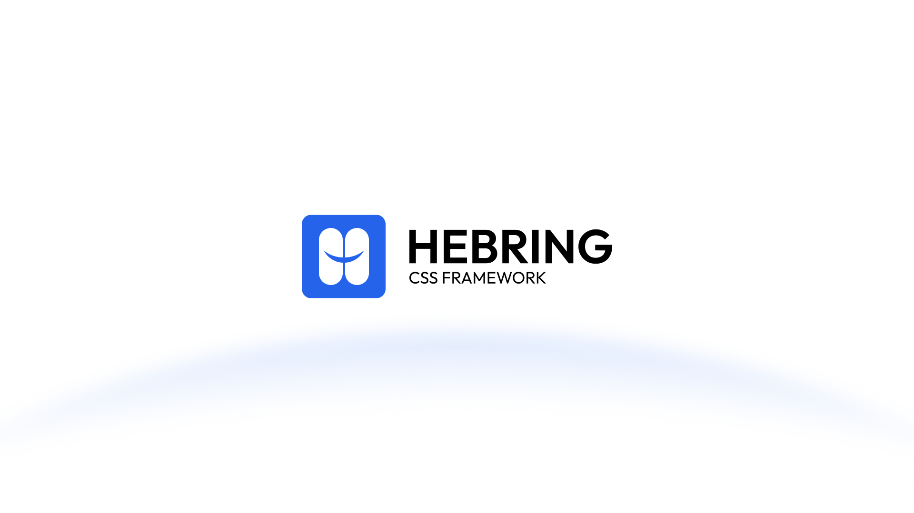

# HEBRING

A modern, lightweight, and understandable CSS framework for building web interfaces.

<p align="center">
  
</p>

## Project Status

**Core Foundation Complete**

The HEBRING Core Framework and Ecosystem Architecture have been implemented and validated. The core is stable, while the ecosystem templates continue to evolve as new application patterns emerge.

## What is HEBRING?

HEBRING is a modern, lightweight, understandable CSS framework for building web interfaces.

It provides a comprehensive foundation for UI development, including:
- Design tokens
- Foundation/reset
- Layout primitives
- Utilities
- Core UI components
- Responsive foundations
- Themes
- Ecosystem UI
- Icons
- Templates

**HEBRING Core is CSS-first and does not require a JavaScript runtime.**

## Core Philosophy

HEBRING is built around eight foundational principles:

1. **Simple**: The framework should be easy to understand and learn.
2. **Predictable**: Class names, architecture, and behavior follow consistent, transparent rules.
3. **Composable**: Developers can combine framework primitives naturally without friction.
4. **Lightweight**: Avoid unnecessary dependencies, excessive generated code, runtime JavaScript, superfluous animations, and heavy abstractions.
5. **Accessible**: Semantic structure and accessibility considerations are baked in from the ground up.
6. **Framework-Agnostic**: The core CSS works completely independently of any JavaScript framework (React, Vue, Svelte, Angular, vanilla HTML, etc.).
7. **Modern**: Employs contemporary CSS features and standards where appropriate without sacrificing maintainability.
8. **Human-Readable**: Developers can inspect the source code and immediately understand how HEBRING works.

## Architecture

HEBRING is organized into a strict hierarchical boundary:

```text
HEBRING
├── Core Framework
│   ├── Design Tokens
│   ├── Foundation
│   ├── Layout
│   ├── Utilities
│   └── Core Components
│
├── Ecosystem
│   ├── UI Components
│   ├── Icons
│   ├── Themes
│   └── Playground
│
└── Templates
    ├── Starter Dashboard
    └── Future Templates
```

- **Core** is independent.
- **Ecosystem** consumes Core.
- **Templates** consume Core and Ecosystem.
- **Applications** consume HEBRING through public APIs.

## Quick Start

Install HEBRING via npm:

```bash
npm install hebring
```

Import the compiled CSS artifact into your frontend project (e.g., Vite, Next.js, or plain HTML):

```javascript
import 'hebring';
// or explicitly import the minified version:
import 'hebring/min';
```

Ecosystem UI components can be imported individually:

```javascript
import 'hebring/ecosystem/ui/menu.css';
import 'hebring/ecosystem/ui/popover.css';
```

## Documentation

- [Getting Started](docs/getting-started.md)
- [Architecture Guide](docs/architecture-guide.md)
- [Design Tokens](docs/design-tokens.md)
- [Layout](docs/layout.md)
- [Utilities](docs/utilities.md)
- [Components](docs/components.md)
- [Responsive](docs/responsive.md)
- [Themes](docs/themes.md)
- [Customization](docs/customization.md)
- [API Reference](docs/api-reference.md)

## Playground

The HEBRING Playground is a framework-neutral reference implementation. It serves as an interactive sandbox to test and validate components using raw HTML and CSS. You can explore the playground locally at `examples/playground/index.html` or refer to the [Playground Architecture](docs/playground-architecture.md).

## Templates

The Template Ecosystem provides complete HTML/CSS starting points for developers.

- [Starter Dashboard](ecosystem/templates/starter-dashboard/): A reference template demonstrating how HEBRING can compose into an application-style interface.
- **Future templates** (e.g., Admin Dashboard, SaaS Dashboard) will demonstrate other common application patterns.

*Note: Templates are reference compositions and are deliberately excluded from the core NPM package to avoid bloat.*

## Developer Experience

HEBRING is designed for an optimal developer experience:
- **Framework-neutral**: Works beautifully with or without a JavaScript framework.
- **CSS-first**: The Core relies strictly on CSS, ensuring zero runtime JavaScript dependencies.
- **Semantic HTML**: Encourages well-structured, meaningful markup.
- **Progressive enhancement**: Leverages native browser capabilities (like the Popover API and native `<dialog>`) where appropriate.

## License

This project is licensed under the [MIT License](LICENSE).
Copyright (c) 2026 HEBRING Contributors.
